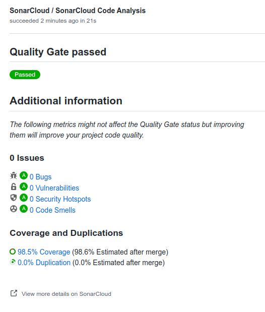

# Gilded Rose Refactoring Kata

This Kata was originally created by Terry Hughes (http://twitter.com/TerryHughes). It is already on GitHub [here](https://github.com/NotMyself/GildedRose). See also [Bobby Johnson's description of the kata](http://iamnotmyself.com/2011/02/13/refactor-this-the-gilded-rose-kata/).

I translated the original C# into a few other languages, (with a little help from my friends!), and slightly changed the starting position. This means I've actually done a small amount of refactoring already compared with the original form of the kata, and made it easier to get going with writing tests by giving you one failing unit test to start with. I also added test fixtures for Text-Based approval testing with TextTest (see [the TextTests](https://github.com/emilybache/GildedRose-Refactoring-Kata/tree/master/texttests))

As Bobby Johnson points out in his article ["Why Most Solutions to Gilded Rose Miss The Bigger Picture"](http://iamnotmyself.com/2012/12/07/why-most-solutions-to-gilded-rose-miss-the-bigger-picture), it'll actually give you
better practice at handling a legacy code situation if you do this Kata in the original C#. However, I think this kata
is also really useful for practicing writing good tests using different frameworks and approaches, and the small changes I've made help with that. I think it's also interesting to compare what the refactored code and tests look like in different programming languages.

I use this kata as part of my work as a technical coach. I wrote a lot about the coaching method I use in this book [Technical Agile Coaching with the Samman method](https://leanpub.com/techagilecoach). A while back I wrote this article ["Writing Good Tests for the Gilded Rose Kata"](http://coding-is-like-cooking.info/2013/03/writing-good-tests-for-the-gilded-rose-kata/) about how you could use this kata in a [coding dojo](https://leanpub.com/codingdojohandbook).

## How to use this Kata

The simplest way is to just clone the code and start hacking away improving the design. You'll want to look at the ["Gilded Rose Requirements"](https://github.com/emilybache/GildedRose-Refactoring-Kata/tree/master/GildedRoseRequirements.txt) which explains what the code is for. I strongly advise you that you'll also need some tests if you want to make sure you don't break the code while you refactor.

You could write some unit tests yourself, using the requirements to identify suitable test cases. I've provided a failing unit test in a popular test framework as a starting point for most languages.

Alternatively, use the "Text-Based" tests provided in this repository. (Read more about that in the next section)

Whichever testing approach you choose, the idea of the exercise is to do some deliberate practice, and improve your skills at designing test cases and refactoring. The idea is not to re-write the code from scratch, but rather to practice designing tests, taking small steps, running the tests often, and incrementally improving the design. 

### Results


```
-------- day 0 --------
name, sellIn, quality
+5 Dexterity Vest, 10, 20
Aged Brie, 2, 0
Elixir of the Mongoose, 5, 7
Sulfuras, Hand of Ragnaros, 0, 80
Backstage passes to a TAFKAL80ETC concert, 15, 20
Backstage passes to a TAFKAL80ETC concert, 10, 49
Backstage passes to a TAFKAL80ETC concert, 5, 49
Conjured Mana Cake, 3, 6

-------- day 1 --------
name, sellIn, quality
+5 Dexterity Vest, 9, 19
Aged Brie, 1, 1
Elixir of the Mongoose, 4, 6
Sulfuras, Hand of Ragnaros, 0, 80
Backstage passes to a TAFKAL80ETC concert, 14, 21
Backstage passes to a TAFKAL80ETC concert, 9, 50
Backstage passes to a TAFKAL80ETC concert, 4, 50
Conjured Mana Cake, 2, 4

-------- day 2 --------
name, sellIn, quality
+5 Dexterity Vest, 8, 18
Aged Brie, 0, 2
Elixir of the Mongoose, 3, 5
Sulfuras, Hand of Ragnaros, 0, 80
Backstage passes to a TAFKAL80ETC concert, 13, 22
Backstage passes to a TAFKAL80ETC concert, 8, 50
Backstage passes to a TAFKAL80ETC concert, 3, 50
Conjured Mana Cake, 1, 2

-------- day 3 --------
name, sellIn, quality
+5 Dexterity Vest, 7, 17
Aged Brie, -1, 3
Elixir of the Mongoose, 2, 4
Sulfuras, Hand of Ragnaros, 0, 80
Backstage passes to a TAFKAL80ETC concert, 12, 23
Backstage passes to a TAFKAL80ETC concert, 7, 50
Backstage passes to a TAFKAL80ETC concert, 2, 50
Conjured Mana Cake, 0, 0

-------- day 4 --------
name, sellIn, quality
+5 Dexterity Vest, 6, 16
Aged Brie, -2, 4
Elixir of the Mongoose, 1, 3
Sulfuras, Hand of Ragnaros, 0, 80
Backstage passes to a TAFKAL80ETC concert, 11, 24
Backstage passes to a TAFKAL80ETC concert, 6, 50
Backstage passes to a TAFKAL80ETC concert, 1, 50
Conjured Mana Cake, -1, 0

-------- day 5 --------
name, sellIn, quality
+5 Dexterity Vest, 5, 15
Aged Brie, -3, 5
Elixir of the Mongoose, 0, 2
Sulfuras, Hand of Ragnaros, 0, 80
Backstage passes to a TAFKAL80ETC concert, 10, 26
Backstage passes to a TAFKAL80ETC concert, 5, 50
Backstage passes to a TAFKAL80ETC concert, 0, 50
Conjured Mana Cake, -2, 0

-------- day 6 --------
name, sellIn, quality
+5 Dexterity Vest, 4, 14
Aged Brie, -4, 6
Elixir of the Mongoose, -1, 0
Sulfuras, Hand of Ragnaros, 0, 80
Backstage passes to a TAFKAL80ETC concert, 9, 28
Backstage passes to a TAFKAL80ETC concert, 4, 50
Backstage passes to a TAFKAL80ETC concert, -1, 0
Conjured Mana Cake, -3, 0

-------- day 7 --------
name, sellIn, quality
+5 Dexterity Vest, 3, 13
Aged Brie, -5, 7
Elixir of the Mongoose, -2, 0
Sulfuras, Hand of Ragnaros, 0, 80
Backstage passes to a TAFKAL80ETC concert, 8, 30
Backstage passes to a TAFKAL80ETC concert, 3, 50
Backstage passes to a TAFKAL80ETC concert, -2, 0
Conjured Mana Cake, -4, 0

-------- day 8 --------
name, sellIn, quality
+5 Dexterity Vest, 2, 12
Aged Brie, -6, 8
Elixir of the Mongoose, -3, 0
Sulfuras, Hand of Ragnaros, 0, 80
Backstage passes to a TAFKAL80ETC concert, 7, 32
Backstage passes to a TAFKAL80ETC concert, 2, 50
Backstage passes to a TAFKAL80ETC concert, -3, 0
Conjured Mana Cake, -5, 0

-------- day 9 --------
name, sellIn, quality
+5 Dexterity Vest, 1, 11
Aged Brie, -7, 9
Elixir of the Mongoose, -4, 0
Sulfuras, Hand of Ragnaros, 0, 80
Backstage passes to a TAFKAL80ETC concert, 6, 34
Backstage passes to a TAFKAL80ETC concert, 1, 50
Backstage passes to a TAFKAL80ETC concert, -4, 0
Conjured Mana Cake, -6, 0

-------- day 10 --------
name, sellIn, quality
+5 Dexterity Vest, 0, 10
Aged Brie, -8, 10
Elixir of the Mongoose, -5, 0
Sulfuras, Hand of Ragnaros, 0, 80
Backstage passes to a TAFKAL80ETC concert, 5, 37
Backstage passes to a TAFKAL80ETC concert, 0, 50
Backstage passes to a TAFKAL80ETC concert, -5, 0
Conjured Mana Cake, -7, 0

-------- day 11 --------
name, sellIn, quality
+5 Dexterity Vest, -1, 0
Aged Brie, -9, 11
Elixir of the Mongoose, -6, 0
Sulfuras, Hand of Ragnaros, 0, 80
Backstage passes to a TAFKAL80ETC concert, 4, 40
Backstage passes to a TAFKAL80ETC concert, -1, 0
Backstage passes to a TAFKAL80ETC concert, -6, 0
Conjured Mana Cake, -8, 0

-------- day 12 --------
name, sellIn, quality
+5 Dexterity Vest, -2, 0
Aged Brie, -10, 12
Elixir of the Mongoose, -7, 0
Sulfuras, Hand of Ragnaros, 0, 80
Backstage passes to a TAFKAL80ETC concert, 3, 43
Backstage passes to a TAFKAL80ETC concert, -2, 0
Backstage passes to a TAFKAL80ETC concert, -7, 0
Conjured Mana Cake, -9, 0

-------- day 13 --------
name, sellIn, quality
+5 Dexterity Vest, -3, 0
Aged Brie, -11, 13
Elixir of the Mongoose, -8, 0
Sulfuras, Hand of Ragnaros, 0, 80
Backstage passes to a TAFKAL80ETC concert, 2, 46
Backstage passes to a TAFKAL80ETC concert, -3, 0
Backstage passes to a TAFKAL80ETC concert, -8, 0
Conjured Mana Cake, -10, 0

-------- day 14 --------
name, sellIn, quality
+5 Dexterity Vest, -4, 0
Aged Brie, -12, 14
Elixir of the Mongoose, -9, 0
Sulfuras, Hand of Ragnaros, 0, 80
Backstage passes to a TAFKAL80ETC concert, 1, 49
Backstage passes to a TAFKAL80ETC concert, -4, 0
Backstage passes to a TAFKAL80ETC concert, -9, 0
Conjured Mana Cake, -11, 0

-------- day 15 --------
name, sellIn, quality
+5 Dexterity Vest, -5, 0
Aged Brie, -13, 15
Elixir of the Mongoose, -10, 0
Sulfuras, Hand of Ragnaros, 0, 80
Backstage passes to a TAFKAL80ETC concert, 0, 50
Backstage passes to a TAFKAL80ETC concert, -5, 0
Backstage passes to a TAFKAL80ETC concert, -10, 0
Conjured Mana Cake, -12, 0

-------- day 16 --------
name, sellIn, quality
+5 Dexterity Vest, -6, 0
Aged Brie, -14, 16
Elixir of the Mongoose, -11, 0
Sulfuras, Hand of Ragnaros, 0, 80
Backstage passes to a TAFKAL80ETC concert, -1, 0
Backstage passes to a TAFKAL80ETC concert, -6, 0
Backstage passes to a TAFKAL80ETC concert, -11, 0
Conjured Mana Cake, -13, 0

-------- day 17 --------
name, sellIn, quality
+5 Dexterity Vest, -7, 0
Aged Brie, -15, 17
Elixir of the Mongoose, -12, 0
Sulfuras, Hand of Ragnaros, 0, 80
Backstage passes to a TAFKAL80ETC concert, -2, 0
Backstage passes to a TAFKAL80ETC concert, -7, 0
Backstage passes to a TAFKAL80ETC concert, -12, 0
Conjured Mana Cake, -14, 0

-------- day 18 --------
name, sellIn, quality
+5 Dexterity Vest, -8, 0
Aged Brie, -16, 18
Elixir of the Mongoose, -13, 0
Sulfuras, Hand of Ragnaros, 0, 80
Backstage passes to a TAFKAL80ETC concert, -3, 0
Backstage passes to a TAFKAL80ETC concert, -8, 0
Backstage passes to a TAFKAL80ETC concert, -13, 0
Conjured Mana Cake, -15, 0

-------- day 19 --------
name, sellIn, quality
+5 Dexterity Vest, -9, 0
Aged Brie, -17, 19
Elixir of the Mongoose, -14, 0
Sulfuras, Hand of Ragnaros, 0, 80
Backstage passes to a TAFKAL80ETC concert, -4, 0
Backstage passes to a TAFKAL80ETC concert, -9, 0
Backstage passes to a TAFKAL80ETC concert, -14, 0
Conjured Mana Cake, -16, 0

-------- day 20 --------
name, sellIn, quality
+5 Dexterity Vest, -10, 0
Aged Brie, -18, 20
Elixir of the Mongoose, -15, 0
Sulfuras, Hand of Ragnaros, 0, 80
Backstage passes to a TAFKAL80ETC concert, -5, 0
Backstage passes to a TAFKAL80ETC concert, -10, 0
Backstage passes to a TAFKAL80ETC concert, -15, 0
Conjured Mana Cake, -17, 0

-------- day 21 --------
name, sellIn, quality
+5 Dexterity Vest, -11, 0
Aged Brie, -19, 21
Elixir of the Mongoose, -16, 0
Sulfuras, Hand of Ragnaros, 0, 80
Backstage passes to a TAFKAL80ETC concert, -6, 0
Backstage passes to a TAFKAL80ETC concert, -11, 0
Backstage passes to a TAFKAL80ETC concert, -16, 0
Conjured Mana Cake, -18, 0

-------- day 22 --------
name, sellIn, quality
+5 Dexterity Vest, -12, 0
Aged Brie, -20, 22
Elixir of the Mongoose, -17, 0
Sulfuras, Hand of Ragnaros, 0, 80
Backstage passes to a TAFKAL80ETC concert, -7, 0
Backstage passes to a TAFKAL80ETC concert, -12, 0
Backstage passes to a TAFKAL80ETC concert, -17, 0
Conjured Mana Cake, -19, 0

-------- day 23 --------
name, sellIn, quality
+5 Dexterity Vest, -13, 0
Aged Brie, -21, 23
Elixir of the Mongoose, -18, 0
Sulfuras, Hand of Ragnaros, 0, 80
Backstage passes to a TAFKAL80ETC concert, -8, 0
Backstage passes to a TAFKAL80ETC concert, -13, 0
Backstage passes to a TAFKAL80ETC concert, -18, 0
Conjured Mana Cake, -20, 0

-------- day 24 --------
name, sellIn, quality
+5 Dexterity Vest, -14, 0
Aged Brie, -22, 24
Elixir of the Mongoose, -19, 0
Sulfuras, Hand of Ragnaros, 0, 80
Backstage passes to a TAFKAL80ETC concert, -9, 0
Backstage passes to a TAFKAL80ETC concert, -14, 0
Backstage passes to a TAFKAL80ETC concert, -19, 0
Conjured Mana Cake, -21, 0

-------- day 25 --------
name, sellIn, quality
+5 Dexterity Vest, -15, 0
Aged Brie, -23, 25
Elixir of the Mongoose, -20, 0
Sulfuras, Hand of Ragnaros, 0, 80
Backstage passes to a TAFKAL80ETC concert, -10, 0
Backstage passes to a TAFKAL80ETC concert, -15, 0
Backstage passes to a TAFKAL80ETC concert, -20, 0
Conjured Mana Cake, -22, 0

-------- day 26 --------
name, sellIn, quality
+5 Dexterity Vest, -16, 0
Aged Brie, -24, 26
Elixir of the Mongoose, -21, 0
Sulfuras, Hand of Ragnaros, 0, 80
Backstage passes to a TAFKAL80ETC concert, -11, 0
Backstage passes to a TAFKAL80ETC concert, -16, 0
Backstage passes to a TAFKAL80ETC concert, -21, 0
Conjured Mana Cake, -23, 0

-------- day 27 --------
name, sellIn, quality
+5 Dexterity Vest, -17, 0
Aged Brie, -25, 27
Elixir of the Mongoose, -22, 0
Sulfuras, Hand of Ragnaros, 0, 80
Backstage passes to a TAFKAL80ETC concert, -12, 0
Backstage passes to a TAFKAL80ETC concert, -17, 0
Backstage passes to a TAFKAL80ETC concert, -22, 0
Conjured Mana Cake, -24, 0

-------- day 28 --------
name, sellIn, quality
+5 Dexterity Vest, -18, 0
Aged Brie, -26, 28
Elixir of the Mongoose, -23, 0
Sulfuras, Hand of Ragnaros, 0, 80
Backstage passes to a TAFKAL80ETC concert, -13, 0
Backstage passes to a TAFKAL80ETC concert, -18, 0
Backstage passes to a TAFKAL80ETC concert, -23, 0
Conjured Mana Cake, -25, 0

-------- day 29 --------
name, sellIn, quality
+5 Dexterity Vest, -19, 0
Aged Brie, -27, 29
Elixir of the Mongoose, -24, 0
Sulfuras, Hand of Ragnaros, 0, 80
Backstage passes to a TAFKAL80ETC concert, -14, 0
Backstage passes to a TAFKAL80ETC concert, -19, 0
Backstage passes to a TAFKAL80ETC concert, -24, 0
Conjured Mana Cake, -26, 0
```
